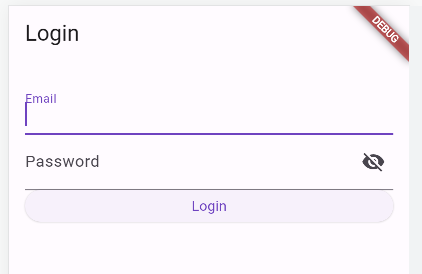
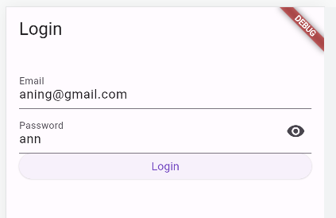
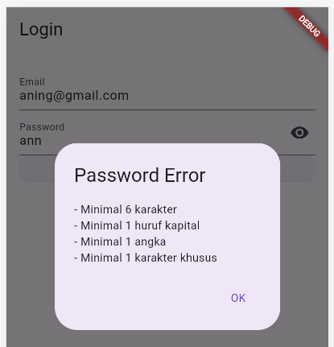
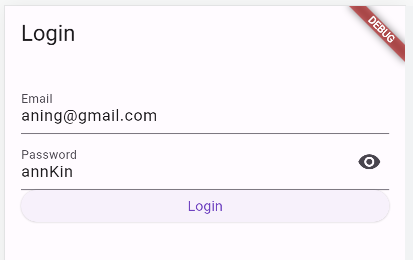
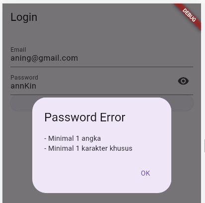
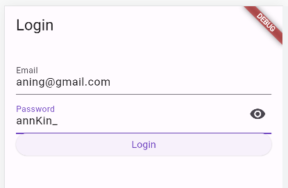
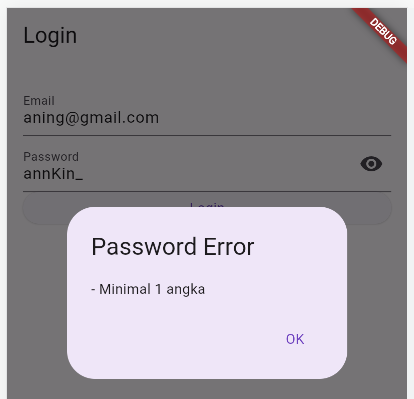
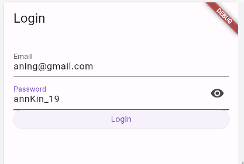
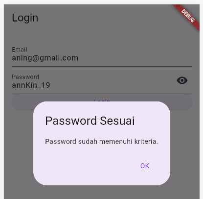

# FLUTTER LOGIN LANJUTAN

**Nama    : Aning Kinanti**  
**NIM     : 312010364**  
**Kelas   : TI.20.A2**  
**Matkul  : Pemrograman Mobile**  

## Implementasi Cek Kekuatan Password pada Halaman Login dengan Flutter

### Output Program

#### Tampilan awal program
  

#### Password akan dicek sampai memenuhi kriteria
  
  
  
  
  
  
  
  